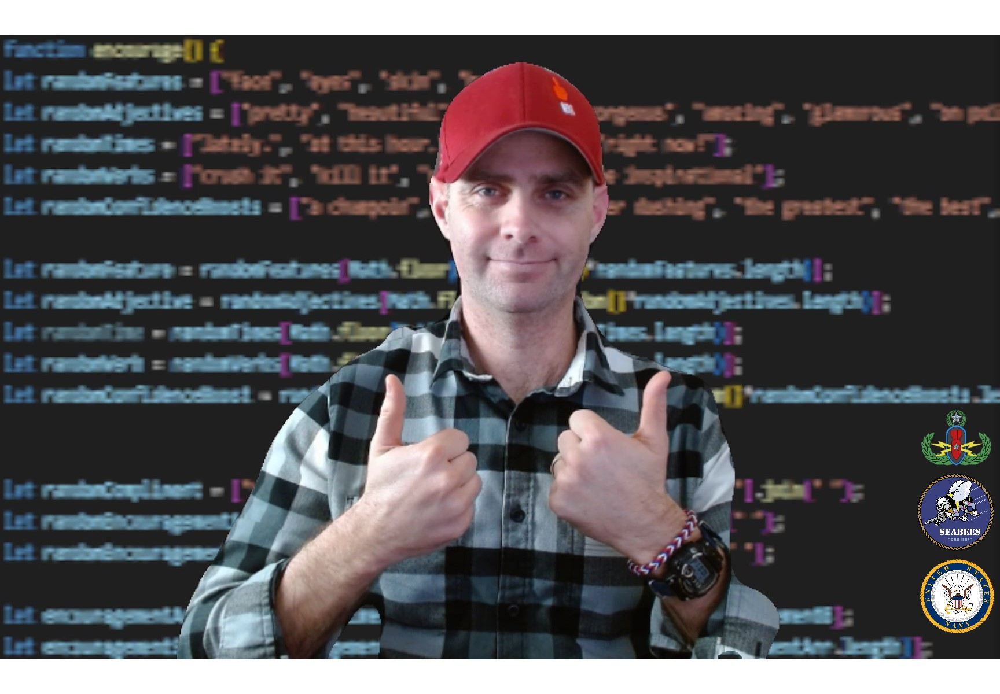
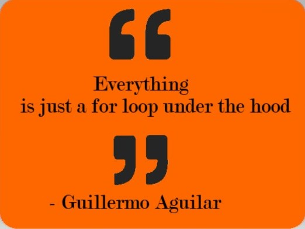

# Heyo! I'm Sean O'Sullivan 👋 

### 🙋‍♂️ Social
 
 

<!--
Here are some ideas to get you started:

- 🔭 I’m currently working on 
- 🌱 I’m currently learning ...
- 👯 I’m looking to collaborate on ...
- 🤔 I’m looking for help with ...
- 💬 Ask me about ...
- 📫 How to reach me: 
- 😄 Pronouns: He/Him
- ⚡ Fun fact: ...

# 🖥️ My Tech Stack Skill Set
## Frontend
## Backend
-->

# ➕ Extras

### Favorite Coding Quote

